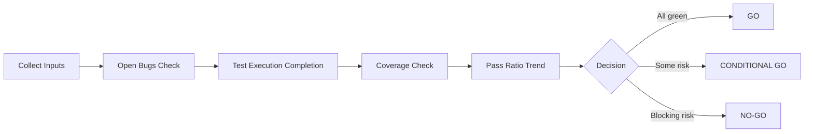

# Mermaid Diagram Skill

## Purpose
Create clear, accurate Mermaid diagrams from Jira, CI, and release-readiness data.

## Use When
- The user asks for a flowchart, sequence, state, timeline, pie, or gantt visualization.
- You need to explain process flow, ownership, test lifecycle, bug lifecycle, or release gates.
- A table/report is hard to read and a diagram communicates faster.

## Do Not Use When
- The user asks for raw numeric output only.
- There is insufficient data to produce a meaningful diagram.

## Output Rules
- Return Mermaid in fenced blocks using the mermaid language tag.
- Use short node labels and consistent naming.
- Prefer left-to-right flow (`flowchart LR`) for release processes.
- Keep each diagram focused on one question.
- Add a short legend only when needed.

## Jira/QA Defaults
- Project default: DP
- Status grouping:
  - Dev: None, To-Do, In Progress
  - QA: Completed (not Accepted)
  - Closed: Accepted

## Recommended Diagram Patterns

### 1) Release Readiness Decision
Use when summarizing GO / CONDITIONAL GO / NO-GO.



### 2) Bug Lifecycle
Use for bug movement and bottlenecks.

```mermaid
flowchart LR
  N[None/Open] --> T[To-Do]
  T --> P[In Progress]
  P --> Q[Completed (QA)]
  Q --> A[Accepted]
```

### 3) CI Priority Buckets
Use for P0-P4 communication.

```mermaid
flowchart LR
  S[Scored Tests] --> P0[P0-Critical]
  S --> P1[P1-High]
  S --> P2[P2-Medium]
  S --> P3[P3-Low]
  P3 --> P4[P4-Deferred\n(Optional policy)]
```

## Quality Checklist
- Diagram reflects actual computed data, not assumptions.
- Labels match report terms exactly.
- Decision criteria are explicit.
- No conflicting status definitions.
