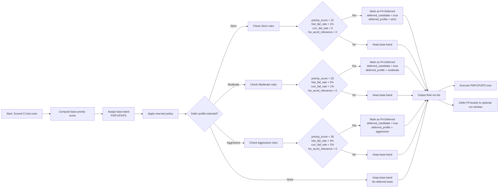

# Deferred Tests Flow

```mermaid
flowchart LR
  A[Start: Scored CI test rows] --> B[Compute base priority score]
  B --> C[Assign base band<br/>P0/P1/P2/P3]
  C --> D[Apply new-test policy]
  D --> E{Defer profile selected?}

  E -->|None| Z[Keep base band<br/>No deferred tests]
  E -->|Strict| S1[Check Strict rules]
  E -->|Moderate| M1[Check Moderate rules]
  E -->|Aggressive| G1[Check Aggressive rules]

  S1 --> S2{priority_score < 22<br/>hist_fail_rate < 1%<br/>curr_fail_rate = 0<br/>hw_accel_relevance = 0}
  M1 --> M2{priority_score < 25<br/>hist_fail_rate < 2%<br/>curr_fail_rate < 1%<br/>hw_accel_relevance = 0}
  G1 --> G2{priority_score < 28<br/>hist_fail_rate < 3%<br/>curr_fail_rate < 2%<br/>hw_accel_relevance = 0}

  S2 -->|Yes| P4S[Mark as P4-Deferred<br/>deferred_candidate = true<br/>deferred_profile = strict]
  S2 -->|No| KS[Keep base band]

  M2 -->|Yes| P4M[Mark as P4-Deferred<br/>deferred_candidate = true<br/>deferred_profile = moderate]
  M2 -->|No| KM[Keep base band]

  G2 -->|Yes| P4G[Mark as P4-Deferred<br/>deferred_candidate = true<br/>deferred_profile = aggressive]
  G2 -->|No| KG[Keep base band]

  P4S --> O[Output final run list]
  KS --> O
  P4M --> O
  KM --> O
  P4G --> O
  KG --> O
  Z --> O

  O --> R1[Execute P0/P1/P2/P3 now]
  O --> R2[Defer P4 bucket to optional run window]
```

## How to View

- Open this file in VS Code.
- Press Ctrl+Shift+V to open Markdown Preview.
